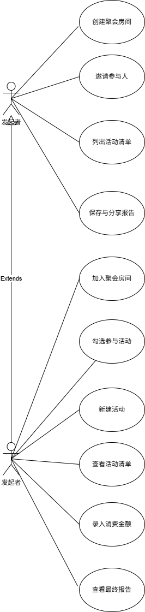

# 聚会出行AA账本微信小程序 - 开发说明文档 (V1.0)

## 1. 项目概述
* **项目名称**：极简AA账本（暂定）
* **项目目标**：针对年轻人聚餐、多人自驾游等多场景下的复杂交叉垫付问题，提供一个“即扫即用、用完即焚”的多人协作记账工具。
* **核心亮点**：
  1. **算法优化**：底层采用图论与贪心算法，求解最小现金流问题，将繁琐的多次交叉转账压缩至最少次数。
  2. **轻量架构**：利用微信云开发，实现“建立房间 -> 协作录入 -> 一键计算 -> 数据即刻销毁”的生命周期闭环，不留存用户冗余数据。

---

## 2. 角色与系统边界
系统剔除传统“管理员”角色，系统维护动作由云函数自动化处理。真实参与用户分为以下两类（互为泛化关系）：

| 角色类别 | 核心职责与用例 |
| :--- | :--- |
| **发起人 (Creator)** | 创建聚会房间（系统生成房号）、列出/新增活动清单、邀请参与人、**一键触发结算（触发后台算法与数据销毁）**、保存与分享最终报告。 |
| **参与人 (Participant)** | 通过邀请进入房间、录入个人垫付金额、勾选自己实际参与的活动（明确分摊范围）、查看实时账单与最终转账报告。 |
---

---

## 3. 技术栈与架构选型
* **前端 (Client)**：Uni-app + Vue 3。采用 Vue 3 响应式语法处理多人协作时的表单状态绑定（如 checkbox 勾选），便于后期按需编译到其他平台。
* **后端 (Server/BaaS)**：微信云开发 (CloudBase)。
* **数据流转策略 (用完即焚)**：
  前端表单 -> 触发云函数录入数据库 -> 结算触发核心算法 -> 返回最优转账视图 -> **云函数静默删除该房间所有数据**。

---

## 4. 数据库设计 (NoSQL 面向文档)
项目摒弃复杂的关系型建表，采用 NoSQL 结构，核心集合 (Collection) 如下：

### 4.1 临时房间表 (`temporary_rooms`)
记录聚会的基本元数据。
```json
{
  "_id": "room_8888",
  "create_time": 1716500000000, 
  "creator_id": "user_openid_01",
  "room_name": "周末五台山自驾游",
  "status": "active" // active-进行中; settled-已结算
}

```

### 4.2 临时消费明细表 (`temporary_expenses`)

将聚餐（单人垫付全员分摊）与自驾游（多人垫付交叉分摊）高度抽象为统一数据模型。每一笔具体的支出对应一条记录。

```json
{
  "_id": "expense_001",
  "room_id": "room_8888",
  "item_name": "服务区加油",
  "payer_id": "user_openid_02", // 谁垫付的（如：李四）
  "total_amount": 200.00,       // 垫付总额
  "participants": ["user_openid_01", "user_openid_02", "user_openid_03"] // 参与分摊者（勾选了此项的人）
}

```

---

## 5. 核心算法设计 (图论与贪心)

系统结算的核心在于将多笔零碎账单转化为最简转账路径。

### 5.1 算法计算步骤

1. **净收益统计**：
* 遍历该 `room_id` 下的所有 `temporary_expenses` 记录。
* 单个项目个人应付 = `total_amount` / `participants.length`。
* **个人净收益 = 个人总垫付 - 个人总应付**。
* 若净收益为正（收款方），若为负（付款方）。


2. **贪心匹配 (最小现金流求解)**：
* 建立两个集合：`debtors` (欠钱方列表，按欠款降序) 和 `creditors` (收款方列表，按收款降序)。
* 每次取出欠钱最多的 A 和收钱最多的 B。
* 若 A 欠的钱 > B 收的钱，则 A 全额转给 B（B出列），A 余额继续与下一个收款人匹配。
* 循环直至两边账目归零。


### 5.2 运算示例

* **原始数据**：总花费 260。李四垫付 200（3人平摊），王五垫付 60（王五、张三2人平摊，李四未参与）。
* **净收益计算**：
* 李四：200 - (200/3) = +133.34
* 张三：0 - (200/3 + 60/2) = -96.66
* 王五：60 - (200/3 + 60/2) = -36.66


* **算法输出**：张三转给李四 96.66；王五转给李四 36.66。（由复杂的交叉账目优化为仅需2笔转账）。

---

## 6. 云函数接口定义 (API Specification)

*采用 Serverless 架构，前端直接调用云函数。*

* `createRoom`：新建房间，生成并返回唯一 `room_id`。
* `addExpense`：录入一笔消费记录（传入金额、垫付人、参与分摊人数组）。
* `getRoomExpenses`：轮询或刷新获取当前房间所有待分摊项目。
* **`settleAndDestroy` (核心枢纽)**：
* **入参**：`room_id`。
* **执行逻辑**：拉取数据 -> 运行核心贪心算法生成最终转账报告 -> 执行 `db.collection('temporary_expenses').where({room_id}).remove()` 销毁数据。
* **返回**：包含优化的转账路径数组。


---

## 7. 实施排期里程碑

1. **Phase 1 (需求与设计)**：完成用例文档、算法逻辑推演与数据库抽象设计。
2. **Phase 2 (云端基建)**：微信开发者工具开通云开发，搭建 `rooms` 与 `expenses` 集合，编写测试用例验证云函数的算法正确性。
3. **Phase 3 (前端与联调)**：使用 Vue 3 搭建页面（表单录入、复选框交互），联调增删改查及一键结算接口。
4. **Phase 4 (兜底与上线)**：添加定时触发器（清理超过24小时未结算的僵尸房间数据），完善真机 UI 测试，提交审核。

```

```